# Running a table at Girls in STEAM

Read these 2 first. They're the lesson.

| Read this | For |
|---|---|
| [KIDS_ROBOTICS_STUDENT_GUIDE.md](KIDS_ROBOTICS_STUDENT_GUIDE.md) | how to coach a kid without doing it for them |
| [KIDS_ROBOTICS_CHALLENGES.md](KIDS_ROBOTICS_CHALLENGES.md) | the 5 challenges, in order |

This page is just what to click. Nothing to install:

**https://eeveemara.github.io/xrp-web/**

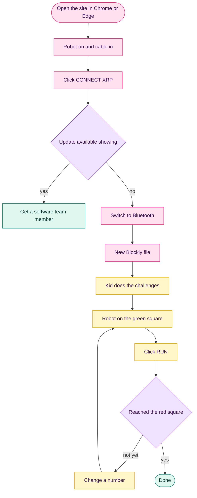

Pink is you. Yellow is the kid.

## Before the kids sit down

1. Open the link in Chrome or Edge and bookmark it. The first time, a **Change Log** box pops up. Close it.

   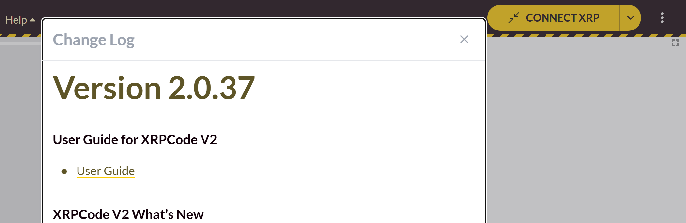

   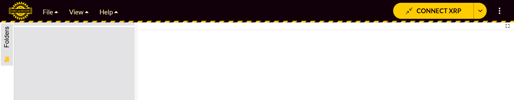

2. Turn the robot on and plug in the USB cable.

   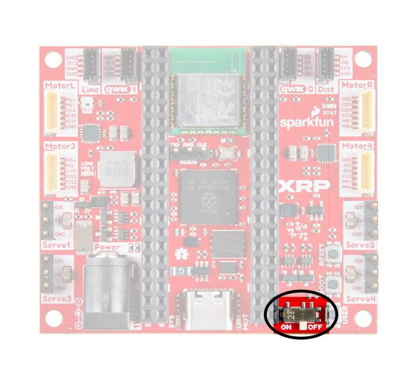

3. Click **CONNECT XRP**, then **USB Connection**.

   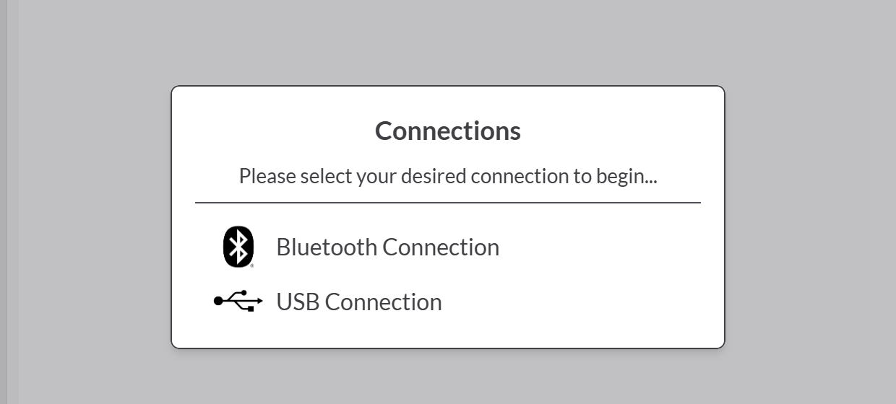

   In Chrome's pop-up the robot shows up as something like `Board in FS mode - Board CDC (COM3)`. Pick it and click **Connect**.

   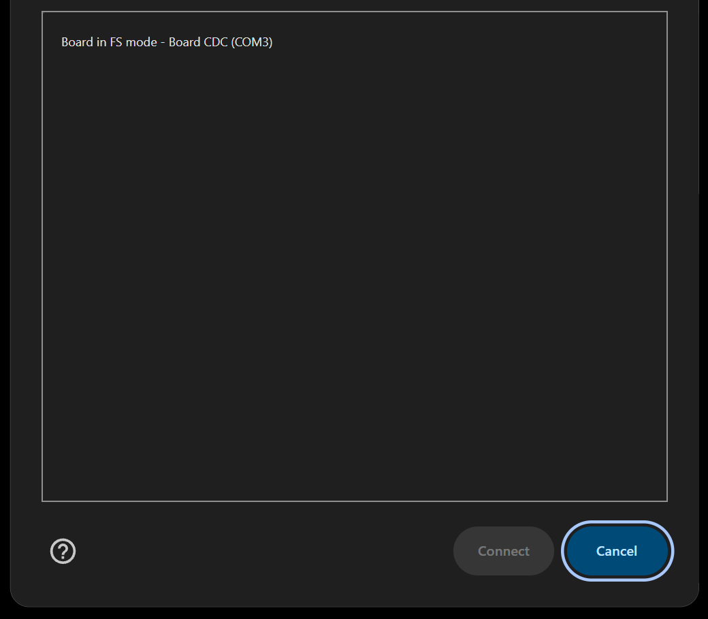

4. The robot's ID shows up in the top bar. If **Update available** is there too, the firmware is old. Get someone on software, or see [XRP_FIRMWARE.md](XRP_FIRMWARE.md).

   

## Getting rid of the cable

### With Bluetooth

Click **Switch to Bluetooth** and do what the box says. **Continue** doesn't work until the cable is out. When Chrome asks, pick your robot's ID and click **Pair**.

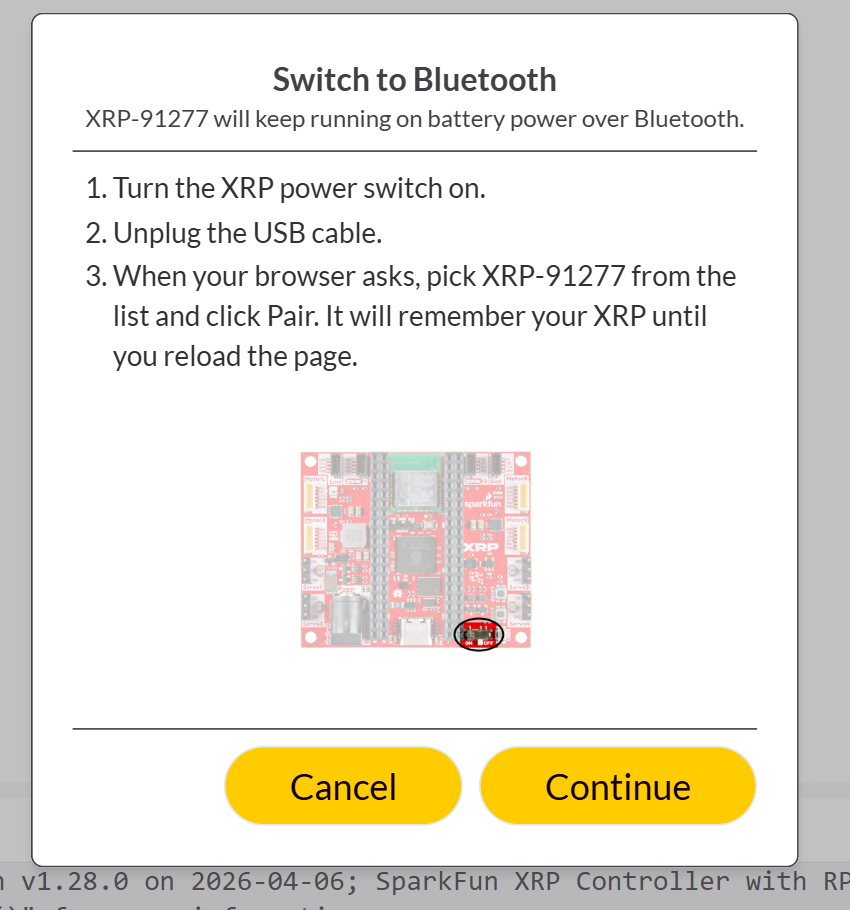

Reloading the page drops the connection. Reconnect with **CONNECT XRP**, then **Bluetooth Connection**.

### Without Bluetooth

Leave the cable in for now and use the power switch trick in "The robot remembers" below.

## Starting a program for a kid

**File**, then **New File**. Set **File Type** to **Blockly File**, type a name, and click **Submit**.

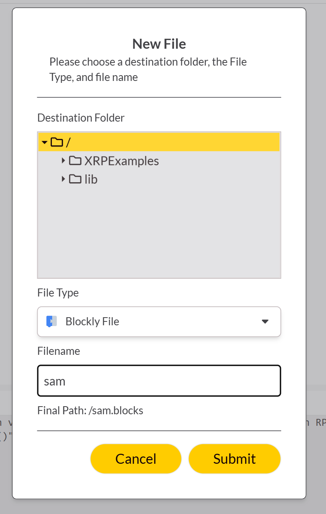

Now it's their turn. Try really hard not to take the mouse.

## The challenges, on the screen

What each challenge in [KIDS_ROBOTICS_CHALLENGES.md](KIDS_ROBOTICS_CHALLENGES.md) looks like. Some kids have never used a mouse, so show them click and drag first.

### Challenge 1: Move the robot

1. Click **XRP Movement**.

   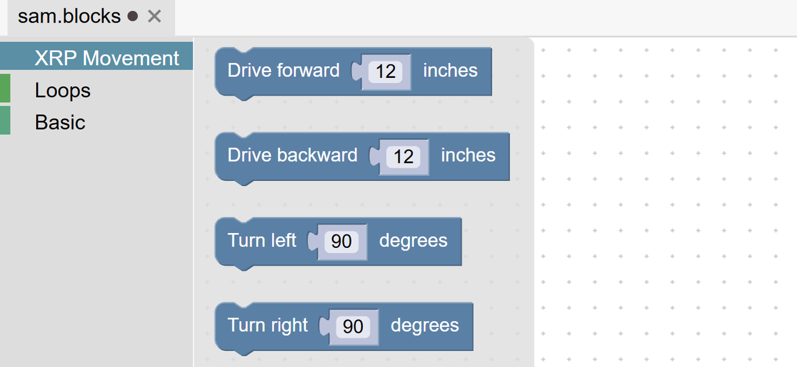

2. Drag **Drive forward** onto the dots.

   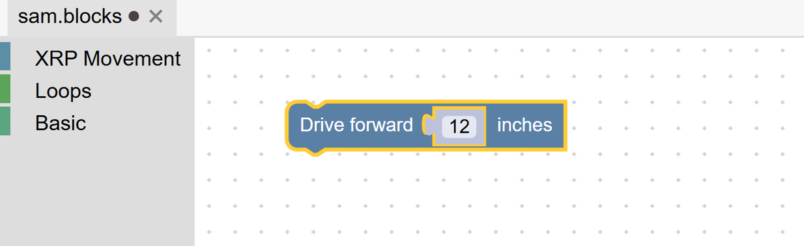

3. Robot down, hands off, **RUN**.

   

   It turns into **STOP** while the robot is going.

   

4. Click the number and type 24.

   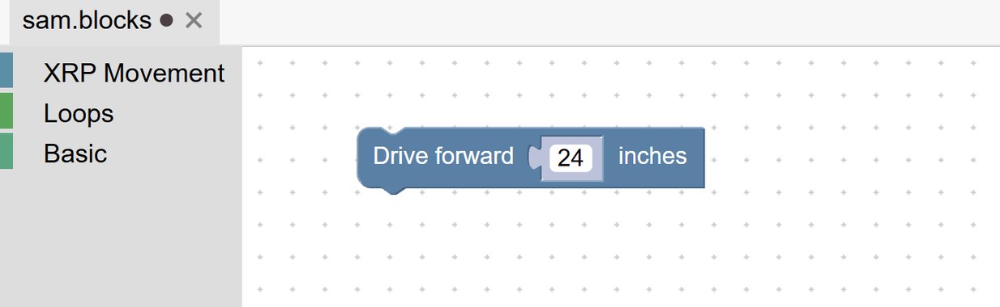

### Challenge 2: Go and come back

Drag **Drive backward** under the first block. A gray shadow shows where it'll snap.

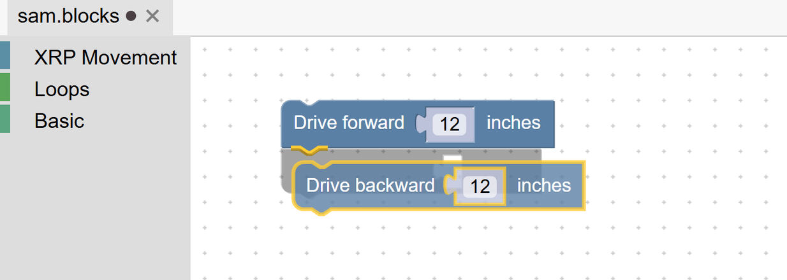

Let go. Blocks run top to bottom.

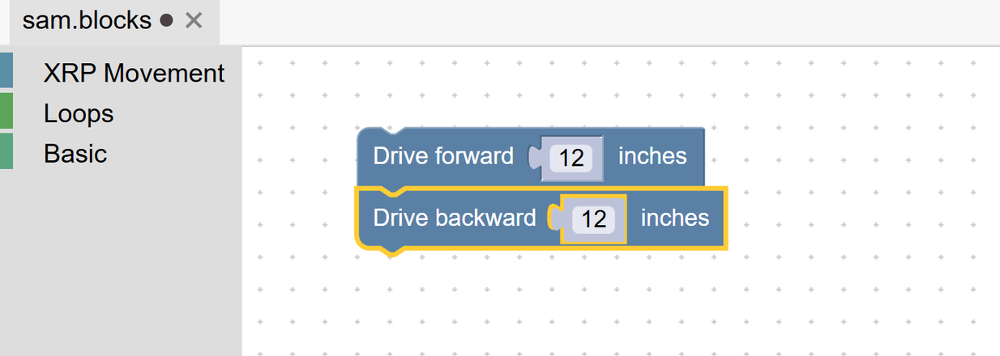

### Challenge 3: Make a turn

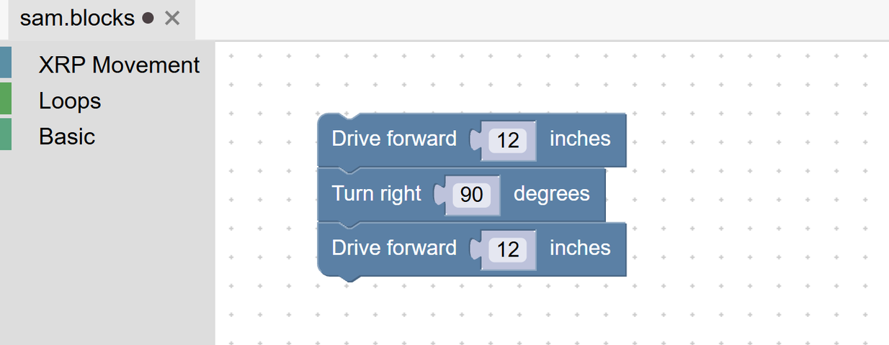

Left and right are the robot's, not the kid's. The trash can in the corner deletes a block, and **Ctrl+Z** undoes.

### Challenge 4: Make a square

Click **Loops** and drag **repeat** out.

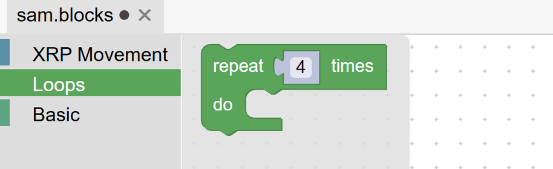

Then drag the other blocks inside it.

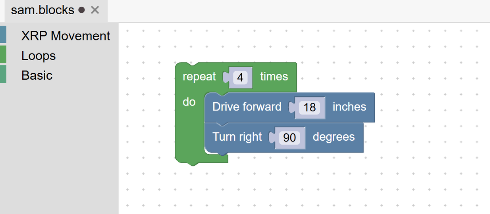

### Challenge 5: Navigate the course

This is the printed [Robot Challenge handout](Robot_Challenge.pdf).

### The other 2 blocks

**Basic** has **Sleep**, which waits for the number of seconds you put in it, and **Stop motors**. The challenges don't use them.

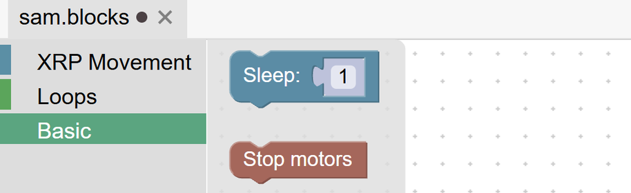

The Python behind the blocks is in [KIDS_ROBOTICS_EVENT.md](KIDS_ROBOTICS_EVENT.md).

## Running it

For the course, the robot starts on the green square.

Hands off before **RUN**. The gyro calibrates for about 1 second at the start, and if the robot gets bumped then, every turn comes out wrong.

## The robot remembers

The robot saves the last program it ran and runs it again every time it's switched on, no laptop needed. So it can take off across the table when you flip the switch.

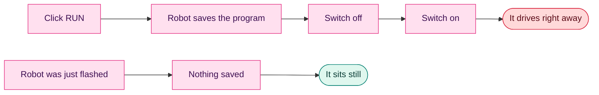

Turn robots on while they're on the floor, or hold them with the wheels in the air.

It's also how you do the course without Bluetooth:

1. Cable in, wheels off the ground, click **RUN** once.
2. Unplug the cable.
3. Put the robot on the green square.
4. Switch it off, then back on, and let go.

## When the next group shows up

Make a new file so they start blank.

Turn robots off between groups.

Swap the batteries when the app says they're low, or the robot drives short and turns weird.
