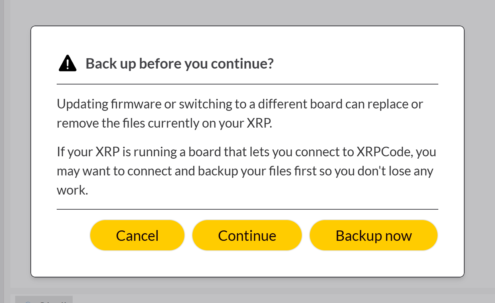
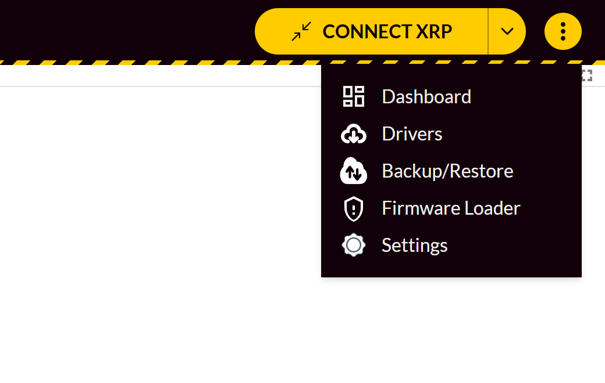
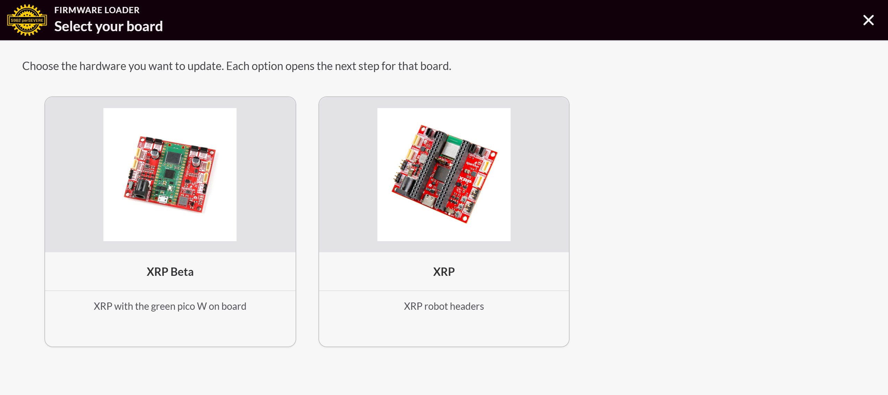
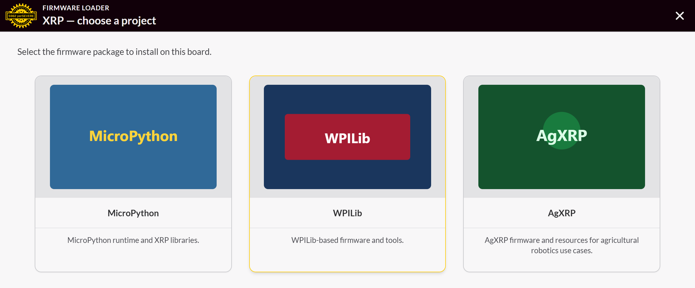
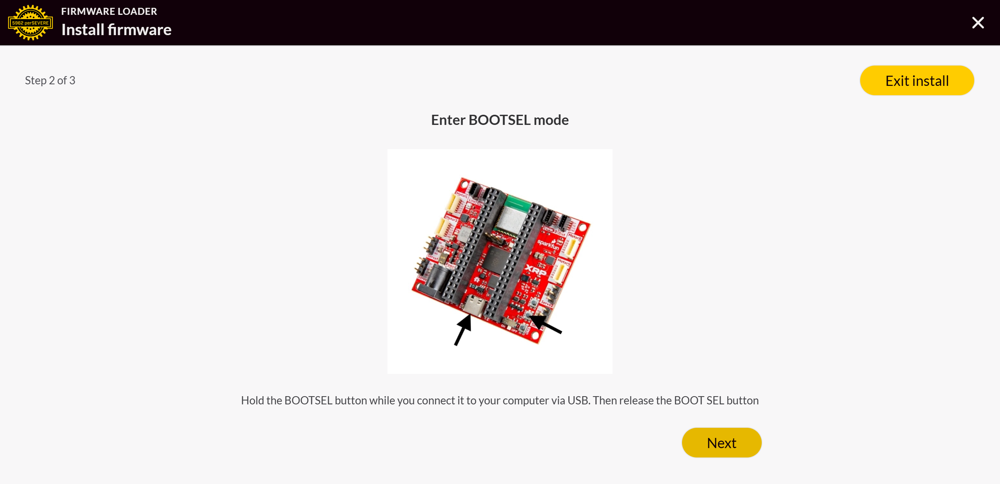

# Putting new firmware on an XRP

Do it from the site. Nothing to install.

**https://eeveemara.github.io/xrp-web/**

It puts on MicroPython 1.28.0 and XRPLib 2026.09.2 (XRP_Firmware v2.0.7).

## Does it need it

Connect over USB. If **Update available** shows up in the top bar, it's behind. No button means it's current.

## Robot connects

Click **Update available**, then **Continue**, and wait for **Update complete**. USB only.



## Robot won't connect

1. 3 dots, then **Firmware Loader**.

   

2. **Continue**, then pick the board. **XRP** is the normal one. **XRP Beta** has the green Pico W on it.

   

3. Pick **MicroPython**.

   

4. Follow the 3 steps on the screen.

   

Turn the robot off and on when it's done, or Bluetooth won't connect. Firmware Loader wipes whatever program was saved on the robot.

## Changing the version

The site is locked to v2.0.7 so robots don't get an update button in the middle of an event. It's one line in `.github/workflows/deploy.yml`:

```yaml
ref: v2.0.7
```

Change it, open a PR for the coaches, merge to `main`, then update every robot.
